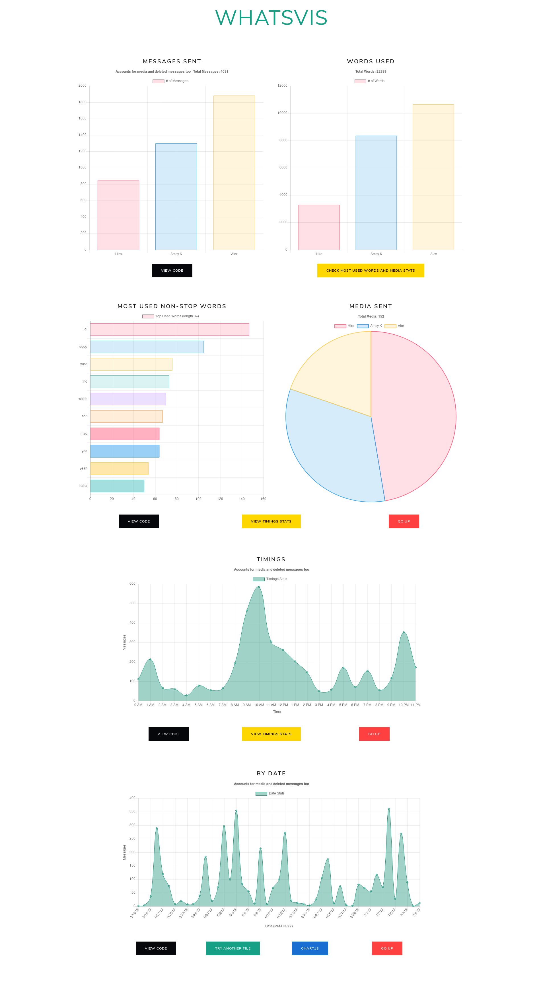

# WhatsAppChatAnalysis

### Uses:

- [chart.js](https://www.chartjs.org)
- [bootstrap](https://getbootstrap.com) (theme: [lux](https://bootswatch.com/lux/))

#### Expected Output:

### Note

- No data is collected.
- Everything over 12 users is displayed gray.
- Uses bar graph for messages and word stats for more than 6 users to keep graphs clean.

### Updates

- 2019/07/18:(https://github.com/rawretrix) added graph for dates
- 2018/01/03: Fixed the lowercase and uppercase word issue in most used words; Changed start page to include screenshots; Organized JS code.
